# 5 Лабораторная
## Задача

Сделать мониторинг сервиса, поднятого в кубере (использовать, например, prometheus и grafana). Показать хотя бы два рабочих графика, которые будут отражать состояние системы. Приложить скриншоты всего процесса настройки.

## Ход работы

Поднимаем локальный Kubernetes-кластер

```minikube start```

и создаем пространство имен для мониторинга

```kubectl create namespace monitoring```

Добавляем в наше пространство имен grafana для визуализации собранных меток, prometheus для сбора меток и robusta (для тестов, посмотреть что как там устроено)

* Grafana и prometheus

```bash
helm install first-prometheus prometheus-community/prometheus -f values/prometheus-values.yaml --namespace monitoring
helm install first-grafana grafana/grafana -f values/grafana-values.yaml --namespace monitoring
```

<p align="center">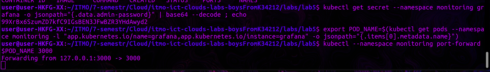</p>

<p align="center">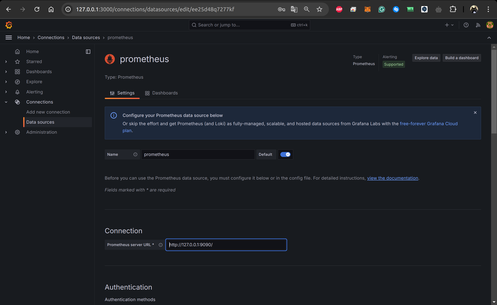</p>

<p align="center">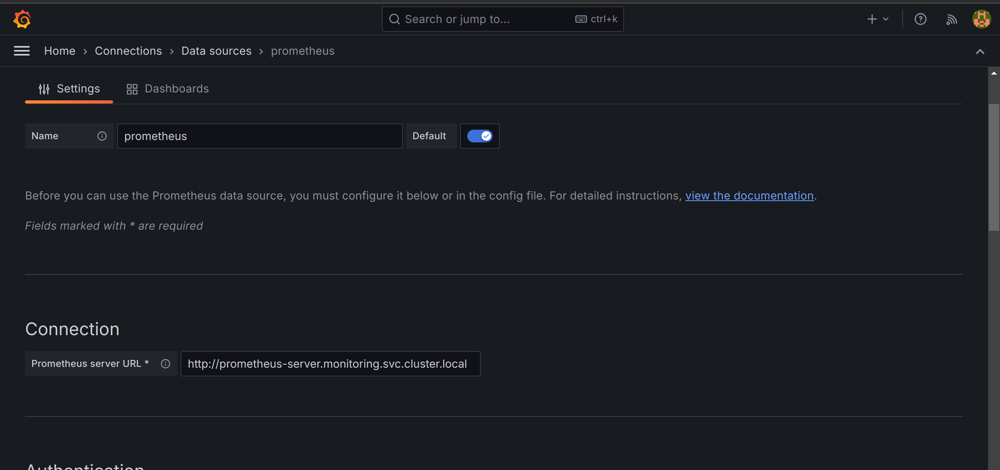</p>


Добавляем ресурс, с которого будут собираться метрики, в моем случае это nginx

```bash
helm install my-nginx bitnami/nginx \
  --set metrics.enabled=true \
  --set metrics.serviceMonitor.enabled=true \
  --set metrics.serviceMonitor.namespace=monitoring \
  --set metrics.serviceMonitor.interval=5s \
  --set metrics.serviceMonitor.scrapeTimeout=5s
```

Прокинув порт увидим ```kubectl --namespace monitoring port-forward svc/my-nginx 9200:80``` nginx

<p align="center">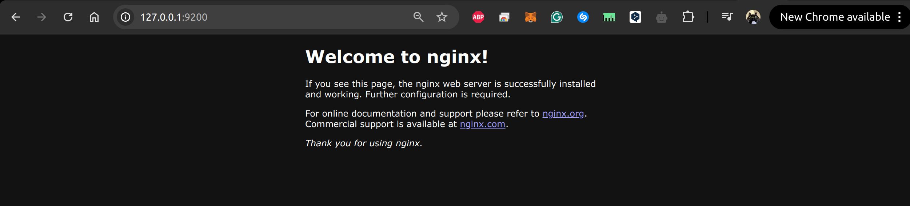</p>

<p align="center">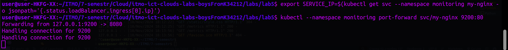</p>


<p align="center">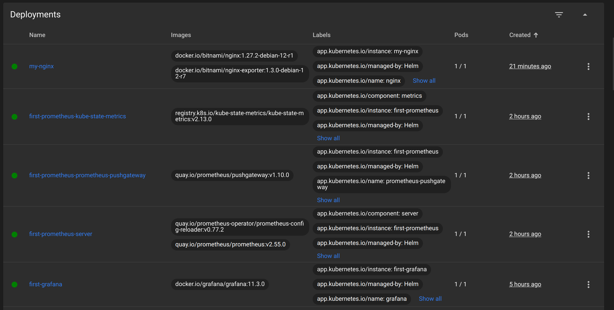</p>

<p align="center">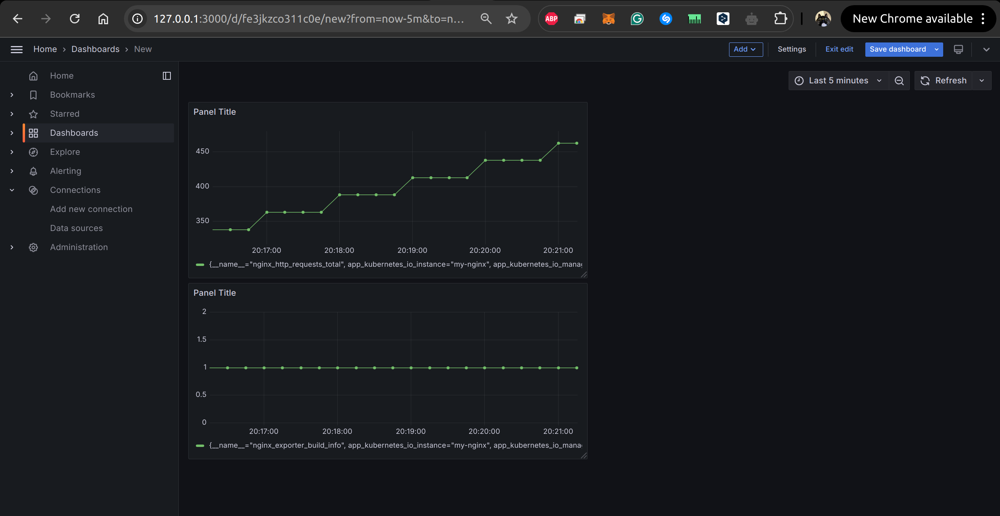</p>

<p align="center">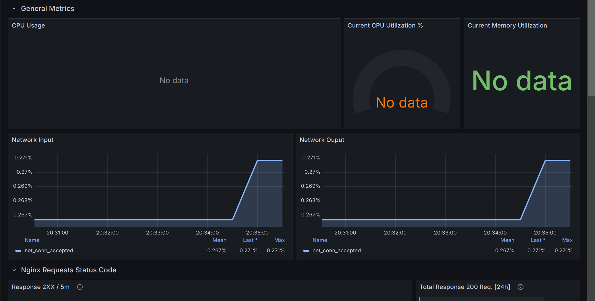</p>

Хотел настроить flask приложение с помощью prometheus_client, но никак не удавалось применить deployment.yaml для него, при том, что в 3-ей лабе проблем с этим не было (писал ошибку docker login, хоть я и был авторизован). Думал, что это связано с тем, что я в этот раз использовал драйвер docker для minikube. Но решение было проще, совсем забыл закинуть образ в minikube
```minikube image load flask-app:latest```
Образ был на локальной машине, поэтому он сохранялся в локальном Docker-реестре. Minikube использует свой собственный Docker-демон, поэтому он "не видел" образы, созданные на локальном Docker-демоне. Minikube не может находить их автоматически

Но заставить prometheus увидить метрики flask пока не удалось, а вот с robusta он их видит, почему я не знаю

<p align="center"></p>

<p align="center">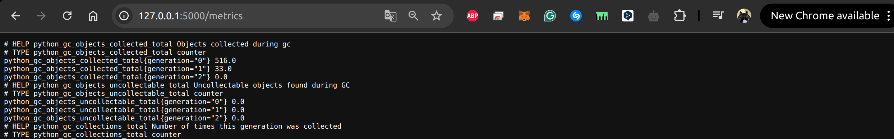</p>

<p align="center"></p>

## Задание со звездочкой (в работе)

### Настройка Robusta


Создаем канал Slack, аккаунт и токен

<p align="center">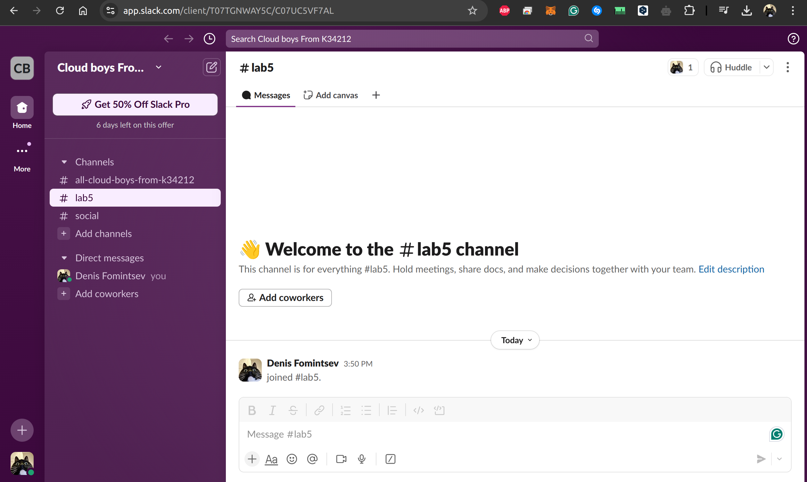</p>

И устанавливаем Robusta

```bash
helm install robusta robusta/robusta -f ./robusta-values.yaml \
  --set clusterName=minikube \
  --namespace monitoring
```

<p align="center">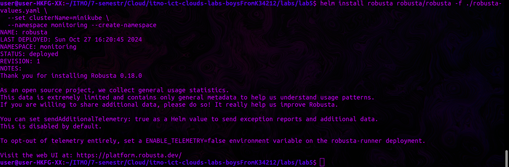</p>

<details>

<summary>robusta-values.yaml</summary>

```yaml
globalConfig:
  signing_key: <...>
  account_id: <...>
sinksConfig:
  - robusta_sink:
      name: robusta_ui_sink
      token: <...>
enablePrometheusStack: true
enablePlatformPlaybooks: true
runner:
  sendAdditionalTelemetry: true
enableHolmesGPT: true
holmes:
  additionalEnvVars:
    - name: ROBUSTA_AI
      value: "true"
prometheus:
  enabled: true

grafana:
  enabled: true
```
</details>

```kubectl get pods -A | grep robusta```

<p align="center">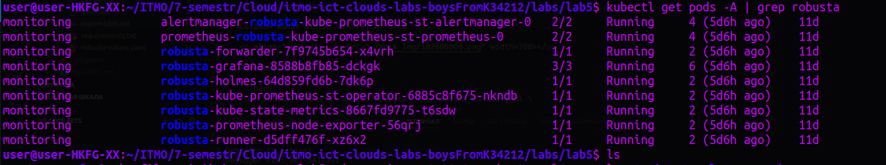</p>


<p align="center">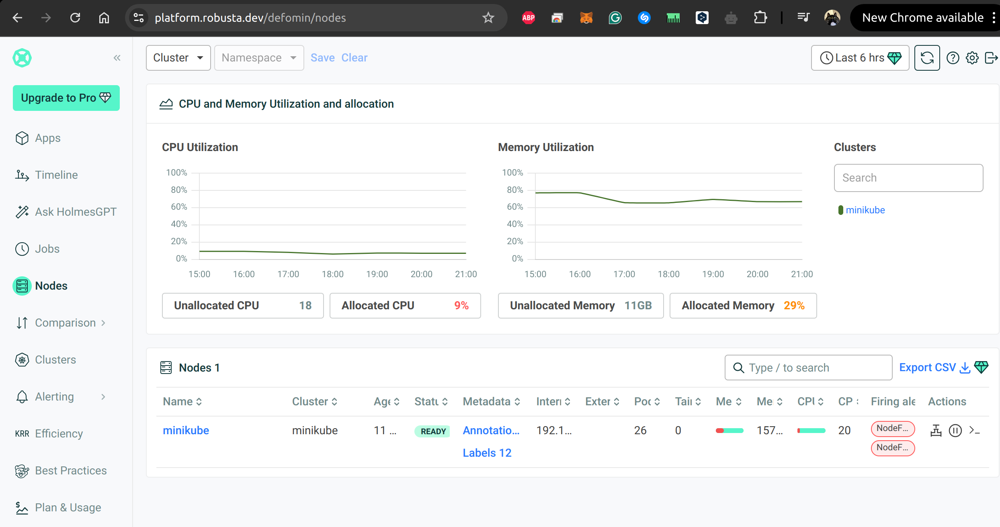</p>


## Вывод 

Сделал мониторинг сервис, поднятый в кубере, познакомился с robusta (alert еще делаю)